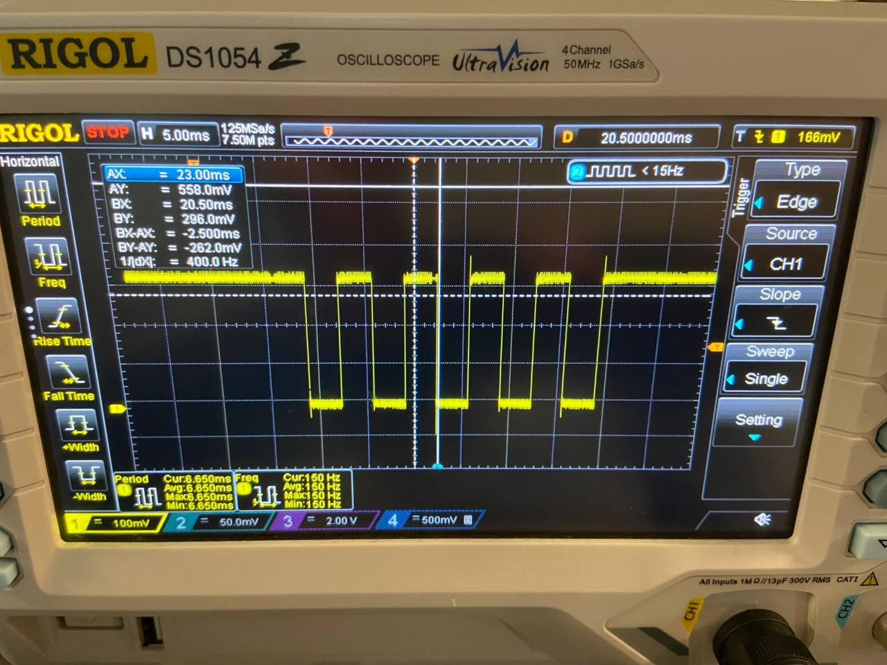

# UART Lab Report

## Lab 2 - UART Software

The **goal** of the UART Software laboratory was to design a driver which implments the UART protocol to handle UART communication through GPIO pins.

### Project 1 - Environment Configuration

The **goal** of this project was to write a working hello world project in C running on the Nios II processor by using the `printf()` function, in order to check wether the environment worked correctly before starting to work on the actual assignments.

The first step was to flash the Nios II processor generated with Platform Designer onto the Altera DE1-SoC board.

The second step was to create a new project with the _Nios II Software Build Tools for Eclipse_ from the Board Support Package (BSP) template generated by Platform Designer.

The third step was to configure the Board Support Package (BSP) correctly through the BSP editor, as detailed by the lab instructions.

- `stdout` set to `jtag_uart_0`
- `sys_clk_timer` set to `none`
- `timestamp_timer` set to `timer_0`

We had to disable the BSP UART driver, because it would have interferred with our code. After this step, it was possible to generate the BSP.

We built the whole project with the following `main()` function.

```c
#include <stdio.h>

int main() {
    printf("Hello, World!\n");
}
```

### Project 2 - Experimenting with GPIO pins

The **goal** of this project was simply to periodically complement the logic value on a pin on the right header connector and display the result on the oscilloscope. 
 
We wrote the following program to accomplish this task:  
 
```c 
#include <stdio.h>
#include <stdint.h>
#include "system.h"
#include "sys/alt_timestamp.h"
#include "altera_avalon_pio_regs.h"
 
void wait_us(uint32_t time_us) {
    uint32_t tps = alt_timestamp_freq();
    uint32_t nticks = tps / 1000000 * time_us;
 
    alt_timestamp_start();
    while(alt_timestamp() < nticks);
}
 
int main()
{
    int val = 1;
    while(1) {
        wait_us(1000);
        IOWR_ALTERA_AVALON_PIO_DATA(NIOS_HEADER_CONN_BASE, val);
        val ^= 1;
    }

    return 0;
}
```

The function `wait_us` starts the timestamp counter and busy waits until the required number of ticks have passed. 
 
The `main` function is simply an infinite loop that waits for one second and flips the value of the first pin of the header connector with a logical xor. As shown in the picture below, we managed to measure the waveform generated by such an operation: 

By connecting the oscilloscope probe to pin 1 of GPIO1 and GND we could see the voltage toggling with the expected period of $2000 ms$


### Project 3 - UART protocol through oscilloscope

The **goal** of project 3 was to send a character through UART to the board and show it through the oscilloscope. To achieve this, we connected our computer with a USB mini type B connector to the DE1-SoC board, and we used PuTTY with the following parameters:

- Baud Rate: 300
- Bits per character: 8
- Parity: none
- Number of stop bits: 1
- Flow Control: None

We also connected pin 2 of the left header connector to an oscilloscope (and used pin 5 of the VGA connector of the board as ground), which was then set to trigger on the falling edge of the signal. After connecting PuTTY to the appropriate COM port, we tried sending, among other characters, the character `0x55` (i.e. `0b01010101`), whose waveform can be seen below: 
 


It can be seen that the start character (0) is followed by the LSB of the character (1). The MSB of the character (0) is followed by an end character (1), after which the line returns to an idle state.
 
##\ Project 4 - Implementing UART receiver in software

The **goal** of this project was to implement a software version of UART. With a similar setup to that of project 3, we flashed the following program into the SoC: 
 
```c 
#include <stdint.h>
#include <stdio.h>

#include "altera_avalon_pio_regs.h"
#include "sys/alt_timestamp.h"
#include "system.h"

// Wait for `time_us` microseconds
void wait_us(uint32_t time_us) {
    uint32_t tps = alt_timestamp_freq();
    uint32_t nticks = tps / 1000000 * time_us;

    alt_timestamp_start();
    while (alt_timestamp() < nticks);
}

// Read GPIO1 pin 1
__attribute__((always_inline)) static inline uint8_t gpio_read() {
    return (uint8_t)IORD_ALTERA_AVALON_PIO_DATA(NIOS_UARTRX_BASE) & 0x00000001;
}

int main() {
    const int BAUD_RATE = 1000;
    const int CHARACTER_SIZE = 8;
    const int STOP_BITS = 1;

    const uint8_t START_BIT = 0x00;
    const uint8_t STOP_SEQ = 0x01;

    int uart_period_us = 1000000 / BAUD_RATE;

    uint8_t fifo[0x100];
    uint8_t fifo_in = 0;
    uint8_t fifo_out = 0;

    int i;
    for (;;) {
        while (gpio_read() != 0);

        // Read character
        uint8_t reading = 0x00;
        for (i = 0; i < CHARACTER_SIZE; i++) {
            wait_us(uart_period_us);
            reading = (reading >> 1) | (gpio_read() << 7);
        }

        // No parity check

        // Read stop sequence
        uint8_t stop_seq = 0x00;
        for (i = 0; i < STOP_BITS; i++) {
            wait_us(uart_period_us);
            stop_seq = (stop_seq << 1) | gpio_read();
        }

        // Eventually log error through jtag interface
        if (stop_seq != STOP_SEQ) {
            puts("[ERROR] Protocol Error");
            break;
        }

        printf("Received %c\n", reading);
        fifo[fifo_in] = reading;
        fifo_in = fifo_in + 1;
    }

    for (;;);
}
``` 
The comments already outline what each part of the code does. It should be noted that we used a FIFO queue to store the read characters. In the end the FIFO was never used, but the entire message is stored there.

We provide the output of the program, which coincides to what we expected to see.


### Project 5 - Testing higher baud rates

We changed the baud rate of the program developed for the previous project, and the highest working standard baud rate we could obtain was 2400. Values higher than 2400 resulted in a protocol error, most probably because the speed of the Nios II processor couldn't catch up with high baud rates. To reach this value we optimized the code with `-O3`.

## Lab 3 - UART Hardware

### Setup

The setup for the third laboratory was almost identical to that of the second one. In this laboratory we defined some global variables and macros which are shared among all projects, to make the code more readable.

```c
    #include <stdint.h>
    #include <stdio.h>

    #include "altera_avalon_pio_regs.h"
    #include "sys/alt_timestamp.h"
    #include "system.h"

    #define BIT(REG, N) ((REG) & (1 << (N)))
    #define TRDY 6
    #define RRDY 7

    volatile uint32_t *const RXDATA = (void *)0x08001060;
    volatile uint32_t *const TXDATA = (void *)0x08001064;
    volatile uint32_t *const STATUS = (void *)0x08001068;
    volatile uint32_t *const CONTROL = (void *)0x0800106C;
    volatile uint32_t *const DIVISOR = (void *)0x08001070;
```

### Project 1 - Reading peripheral registers

The **goal** of project one was simply to read from the `EXDATA`, `TXDATA`, `STATUS`, `CONTROL` and `DIVISOR` values and printed their values onto `stdout`. To accomplish this, we wrote the following program:
 
```c
    int main() {
        printf("rxdata: 0x%08lx\n", *RXDATA);
        printf("txdata: 0x%08lx\n", *TXDATA);
        printf("status: 0x%08lx\n", *STATUS);
        printf("control: 0x%08lx\n", *CONTROL);
        printf("divisor: 0x%08lx\n", *DIVISOR);

        for (;;);

        return 0;
    }
```

Which generated the following output after execution:

```
    rxdata: 0x00000000
    txdata: 0x00000000
    status: 0x00000060
    control: 0x00000080
    divisor: 0x000001b2
```

In decimal, the value of the divisor register is $434$.

### Project 2 - Computing the `DIVISOR` register

The **goal** of this project was to compute the value of the `DIVISOR` register to get a baud rate of $115200$ from a clock frequency of $50 MHz$.  

$$
    \begin{align}
        f_\text{uart} &= \frac{f_\text{ck}}{\mathtt{DIV}+1} \\
        \implies \mathtt{DIV} &= \frac{f_\text{ck}}{f_\text{uart}} - 1 = \frac{50 MHz}{115200 Hz} - 1 \simeq  433.0278
    \end{align}
$$
 
This number matches the one we found inside the `DIVISOR` register in the previous project aside from the fact that it's ceiled instead of it being floored.

The second point of this exercise asked us to compute the value of `DIVISOR` to set a baud rate of $2400$. By using the same formula we got $20832.33$ which we rounded to $20832$. The following code demonstrates the update of the `DIVISOR` register is performed.

```c
    int main() {
        printf("divisor: 0x%08lx\n", *DIVISOR);
        *DIVISOR = 20832;
        printf("divisor: 0x%08lx\n", *DIVISOR);
        for (;;);
    }
```

### Project 3 - Behavior of the `STATUS` register

The **goal** of this lab was to 
1. Write a character to the terminal and print the value of the `STATUS` register immediately before and after the transmission. 
2. Modify the program to make two consecutive writes of the `TXDATA` register, and document the value of the `STATUS` register before and after the transmissions. 
3. Do the same thing as point 2 except for the fact that we should send 3 consecutive characters instead of two.

```c
    int main() {
        uint8_t *msg = "msg";
        uint32_t status_before, status_after;

        *DIVISOR = 20832;

        for (uint8_t *c; *c != '\0'; c++) {
            status_before = *STATUS;
            *TXDATA = *c;
            status_after = *STATUS;

            printf("status before: 0x%08lx\n", status_before);
            printf("status after: 0x%08lx\n", status_after);
        }

        for (;;);
    }
```

For a single consecutive character the final result is:

```
status before: 0x00000060
status after: 0x00000040
```

Action: bit `TMT` is cleared. This is because the sending buffer is filled with the data to transmit. `TRDY` is still set, because the `TXDATA` is ready to accept new data as soon as the previously written data enters the buffer.

For two consecutive characters the final result is:

```
status before: 0x00000040
status after: 0x00000000
```

Action: bit `TRDY` is cleared. This is because the sending buffer is filled with the first data to transmit, and now `TXDATA` stores the second character to transmit.

For three consecutive characters the final result is:

```
status before: 0x00000000
status after: 0x00000110
```

Action: bit `TOE` is set. Also bit `E`, to indicate that an error occurred. This is because by writing to `TXDATA` before `TRDY` is set causes a loss of the second data to transmit.

### Project 4 - Writing through UART

#### Part one - Sending a string

The **goal** of the first part of project 4 was to write a Nios II program that sends the string `"My name is ..."` over UART. To accomplish this we wrote the following program: 
 
```c 
    void UART_write(char *msg) {
        for (char *c = msg; *c != '\0'; c++) {
            while (!BIT(*STATUS, TRDY));
            *TXDATA = *c;
        }
    }

    int main() {
        *DIVISOR = 20832;

        UART_write("Hello my name is Claudio\n\r");

        for (;;);
    }
``` 

Here is a picture of the entire comunication, seen through the oscilloscope:
 

 
For the sake of brevity, on the following sections we will also ommit the definition of the `UART_write` function. 
 
#### Part Two - Sending a long string

The **goal** of this part was to send a very long string through UART at a slower baud rate to measure the effective baud rate of the ransmission.

To achieve this, we fed the terminal with an excerpt of _De Rerum Natura_, written by the latin poet _Lucretius_. The string contained $4387$ characters. We timed it by registering a chronometer and the monitor receiving the string with a slow motion video.
 


 
Above you can find respectively the first and last frame in which data was received.

- First: 8.58s
- Last: 28.23s
- Duration: 19.65s

The Effective Baud Rate ($\text{EBR}$) is the ratio between the characters sent ($N$) and the time it took to send them ($T$). It is always lower or equal to the Baud Rate ($\text{BR}$):

$$
    \mathrm{EBR} = \frac{\mathrm{N}}{\mathrm{T}} \le \mathrm{BR}
$$

Thus the EBR is $223.26$ instead of the desired $300$.

### Project 5 - Receiving over UART

#### Part one - Implementing reception
The **goal** of this part was to write a program that received characters over UART by reading their ASCII values from the `RXDATA` register and print them to `stdout`. To achieve this, we wrote the following program:

```c 
int main() {
    uint8_t reading;
    uint32_t status_before, status_after;

    *DIVISOR = 20832;
    *CONTROL &= ~(uint32_t)0b11111111;
    *STATUS &= ~(uint32_t)0b100011111;

    for (;;) {
        if (BIT(*STATUS, RRDY)) {
            status_before = *STATUS;
            reading = (uint8_t)*RXDATA;
            status_after = *STATUS;

            printf("status before: 0x%08lx\n", status_before);
            printf("%c\n", reading);
            printf("status after: 0x%08lx\n", status_after);
        }
    }
}
```

To begin, we clear the `CONTROL` register to disable interrupts and reset the `STATUS` register to avoid reading an incorrect value that might have been stored before the program started.

#### Part two - Breaking the protocol

The **goal** of this part was to study the behavior of the peripheral when the ready bit is not tested. To achieve this, we removed the ready check of part one before reading `RXDATA` as instructed:

```c 
int main() { 
    uint8_t reading; 
    uint32_t status_before, status_after; 

    *DIVISOR = 20832; 
    *CONTROL &= ~(uint32_t)0b11111111; 

    for (;;) { 
        reading = (uint8_t) *RXDATA; 
        putc(reading, stdout); 
    } 
} 
```

When reading data from the `RXDATA` register, we repeatedly read the same value until a new character was transmitted, but other than that nothing noteworthy occurred. This happened because, when reading from `RXDATA`, the `RRDY` bit is automatically cleared by the peripheral. But since the printing function is not gated behind a test of the `RRDY` bit, we can't notice it.

#### Part three - Triggering receive overrun

The **goal** of this exercise is to implement a program that receives characters over UART, and introduces a delay between character reads. If the delay is too big, we expect to see the `ROE` bit triggered.

```c 
// Waits for the specified amount of microseconds
void wait_us(uint32_t time_us) {
    uint32_t tps = alt_timestamp_freq();
    uint32_t nticks = tps / 1000000 * time_us;

    alt_timestamp_start();
    while (alt_timestamp() < nticks);
}

int main() {
    uint8_t reading;
    uint32_t status_before, status_after;

    *DIVISOR = 20832;
    *CONTROL &= ~(uint32_t)0b11111111;
    *STATUS &= ~(uint32_t)0b100011111;

    for (;;) {
        if (BIT(*STATUS, RRDY)) {
            status_before = *STATUS;
            reading = (uint8_t)*RXDATA;
            status_after = *STATUS;

            printf("status before: 0x%08lx\n", status_before);
            printf("reading: %c\n", reading);
            printf("status after: 0x%08lx\n", status_after);

            // 1 second delay
            wait_us(1000000);
        }
    }
}
``` 

With a $1s$ delay, the receive overrun was easy to trigger by pressing keys on the terminal with a period smaller than 1 second. Following we left an example output, obtained by ripetitively pressing `a` at a high rate:

```
status before: 0x000000D0
reading: a
status after: 0x00000060
status before: 0x000001D8
reading: a
status after: 0x00000168
```

The first reading of `a` clears the `RRDY` flag, after which many characters try to fill the receive buffer while the code busy waits. After one second, the receive buffer is read again. `RRDY` is again set, but this time `ROE` and `E` are set to, to indicate that a receive overrun has occurred.

 
### Project 6 - Transmitting at the maximum baud rate

For project 6, we simply adjusted the divisor in order to be able to handle a baud rate of $115200$: 

```c 
int main() {
    const uint32_t BAUD_RATE = 115200;

    uint8_t reading;
    uint32_t status_before, status_after;

    *DIVISOR = 50000000 / BAUD_RATE - 1;
    *CONTROL &= ~(uint32_t)0b11111111;
    *STATUS &= ~(uint32_t)0b100011111;

    for (;;) {
        if (BIT(*STATUS, RRDY)) {
            status_before = *STATUS;
            reading = (uint8_t)*RXDATA;
            status_after = *STATUS;

            printf("status before: 0x%08lx\n", status_before);
            putc(reading, stdout);
            putc('\n', stdout);
            printf("status after: 0x%08lx\n", status_after);
        }
    }
} 
```

The transmission was much faster, but other tan that nothing happened. We didn't use the oscilloscope here for a question of time.

### Project 10 - Implementing imterrupts

For project 10 we had to implement interrupts for handling the peripheral. In particular this time we configured the control register to generate interrupts on receive ready. After that, we registerd the `void uart_isr(void *context)` interrupt service routine to handle reception. It tests for the receive ready bit, and then it reads a character from the receive register and it retransmits it to the transmit register.

The main simply counts on the 7-segment display up to `0xFFFFFF`. Unfortunately, despite our best efforts, we could not get the interrupt to work.
 
```c 
uint32_t *const UART0_BASE = (void *)0x08001060;
const uint32_t RXDATA_OFF = 0;
const uint32_t TXDATA_OFF = 1;
const uint32_t STATUS_OFF = 2;
const uint32_t CONTROL_OFF = 3;
const uint32_t DIVISOR_OFF = 4;

void uart_isr(void *context) {
    printf("Interrupt triggered\n");
    IOWR_ALTERA_AVALON_PIO_DATA(NIOS_HEADER_CONN_BASE, 1);
    uint32_t *uart_base = *(uint32_t **)context;

    uint32_t status = *(uart_base + STATUS_OFF);
    if (!BIT(status, RRDY) || !BIT(status, TRDY)) {
        return;
    }

    uint8_t reading = *(uart_base + RXDATA_OFF);
    *(uart_base + TXDATA_OFF) = reading;
    IOWR_ALTERA_AVALON_PIO_DATA(NIOS_HEADER_CONN_BASE, 0);
}

// Waits for the specified amount of microseconds
void wait_us(uint32_t time_us) {
    uint32_t tps = alt_timestamp_freq();
    uint32_t nticks = tps / 1000000 * time_us;

    alt_timestamp_start();
    while (alt_timestamp() < nticks);
}

int main() {
    const uint32_t BAUD_RATE = 9600;

    *DIVISOR = 50000000 / BAUD_RATE - 1;
    *CONTROL &= ~(uint32_t)0b11111111;
    *STATUS &= ~(uint32_t)0b100011111;

    alt_ic_isr_register(0, UART_0_IRQ, uart_isr, (void *)(&UART0_BASE), NULL);
    *CONTROL |= 0x80;

    for (uint32_t count = 0;; count = (count + 1) & 0xFFFFFF) {
        IOWR_ALTERA_AVALON_PIO_DATA(NIOS_7SEG_BASE, count);
        wait_us(500000);
    }
}
```